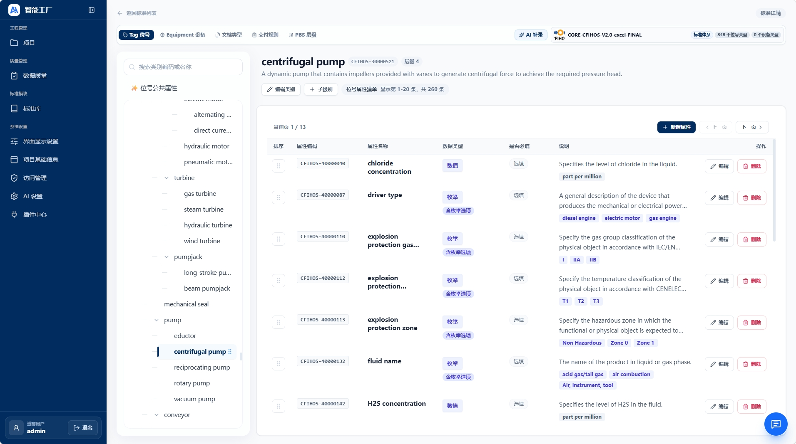
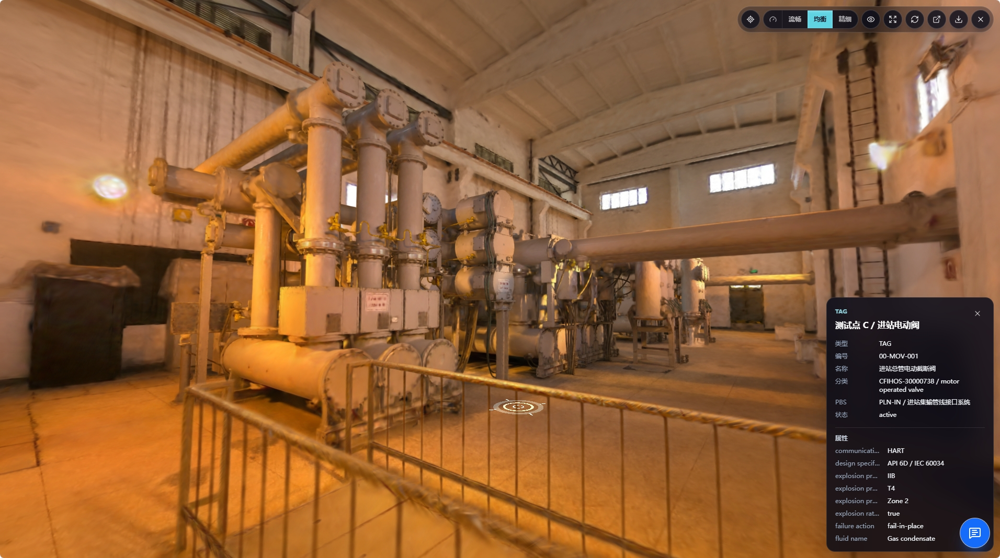

# AI PLANT

**Languages:** [English](#english) | [中文](#中文)

## English

AI PLANT is a web system for engineering project handover data. It helps teams manage engineering standards, project data, TAG and equipment registers, document archives, and 3D visualization assets. This repository includes the frontend, backend, database migrations, sample seed data, and local development infrastructure.

### Features

- **Engineering standards library**: Manage standards, class hierarchies, attribute definitions, document types, and discipline delivery requirements. Bundled with sample CFIHOS standard data.
- **Project data management**: Create projects, bind reference standards, and manage project PBS, TAGs, equipment instances, and TAG-to-equipment implementation relationships.
- **TAG and equipment registers**: View TAG and equipment attributes by standard class, maintain equipment implementation history, and manage attribute values.
- **Document management and preview**: Archive project documents, versions, and revisions, with preview paths for Office, PDF, CAD, and related engineering files.
- **3D model visualization**: Browse Spark RAD/RADC assets and semantic object links. The open-source sample includes the `pump_room` 3D model.
- **Data quality checks**: Provides backend tools and page entry points for project data quality checks, standard drift checks, and missing or abnormal attribute checks.
- **Access control and login**: Built-in RBAC permissions, HttpOnly cookie sessions, and first-administrator bootstrap flow.
- **Branding settings**: Defaults to AI PLANT / 智能工厂 and the Aigeek logo. Supports custom logo and login background uploads through system settings.
- **Trusted plugin mechanism**: Includes a generic plugin registry, installation flow, permission model, and menu extension mechanism. The open-source baseline does not include business plugin packages such as progress management.

### Built-in Sample Data

The open-source baseline can be started with ready-to-use sample data:

- CFIHOS standard data.
- KBT-CPF sample project data.
- `pump_room` document records, visualization metadata, Spark RAD/RADC assets, and source model package.
- Login background image and default branding data.

Object-storage sample files are located in `sample-data/minio`. The `pump_room` source model zip is managed with Git LFS, so make sure LFS files are pulled after cloning the repository.

### Online Demo

You can try the system directly in the online demo environment:

- Demo URL: `http://www.waynehuang.top:15173`
- Default username: `admin`
- Default password: `AIGeek@2025`

The demo includes the CFIHOS standard, the sample project, and the `pump_room` 3D model. It is suitable for quickly reviewing the standards library, project data, document management, and 3D model browsing capabilities.

### Preview

#### CFIHOS Standards Library



#### 3D Model and Semantic Object Links



### Tech Stack

- Frontend: React 19, Vite, TypeScript, Tailwind CSS, React Router, Lucide React, pnpm.
- Backend: FastAPI, Pydantic, psycopg, PostgreSQL, openpyxl, httpx, boto3.
- Local infrastructure: PostgreSQL 16, MinIO, kkFileView, Docker Compose.
- Default ports: frontend `5173`, backend `3001`, PostgreSQL `55432`, MinIO `9000/9001`, kkFileView `8012`.

### Quick Start

#### 1. Clone the repository and pull LFS files

```bash
git clone https://github.com/aigeek-tech/AI-PLANT.git
cd AI-PLANT
git lfs pull
```

#### 2. Start local infrastructure

```bash
docker compose up -d postgres minio minio-init kkfileview
```

On first startup, PostgreSQL automatically applies migrations and seed data. The MinIO initialization task synchronizes sample objects from `sample-data/minio` into the local bucket.

#### 3. Start the backend

```bash
cd backend
python -m venv .venv
.venv\Scripts\python -m pip install -r requirements.txt
.venv\Scripts\python -m uvicorn app.main:app --reload --host 127.0.0.1 --port 3001
```

#### 4. Start the frontend

```bash
cd frontend
pnpm install
pnpm dev
```

Then open `http://localhost:5173`. If the database does not contain an administrator account, the login page will guide you through creating the first administrator.

Default demo administrator:

- Username: `admin`
- Password: `AIGeek@2025`

This account is created during backend startup through `SMART_DESIGN_BOOTSTRAP_ADMIN_USERNAME` / `SMART_DESIGN_BOOTSTRAP_ADMIN_PASSWORD`. If an account with the same username already exists in the database, startup will not overwrite its password.

For Windows local development, you can also use the script in the repository root:

```powershell
.\start-dev.ps1
```

### Run with Aliyun ACR Images

The application images are also published to Aliyun Container Registry under the `ai-geek` namespace:

- `crpi-xxa0zq9b76nhf9vd.cn-hangzhou.personal.cr.aliyuncs.com/ai-geek/ai-plant-backend`
- `crpi-xxa0zq9b76nhf9vd.cn-hangzhou.personal.cr.aliyuncs.com/ai-geek/ai-plant-frontend`
- `crpi-xxa0zq9b76nhf9vd.cn-hangzhou.personal.cr.aliyuncs.com/ai-geek/ai-plant-document-converter`

Available tags:

- `latest`
- `20260525-000522-2937096`

To run the open-source stack with the published application images instead of building locally:

```bash
docker login crpi-xxa0zq9b76nhf9vd.cn-hangzhou.personal.cr.aliyuncs.com
AI_PLANT_IMAGE_TAG=latest docker compose \
  -f docker-compose.yml \
  -f deploy/home/docker-compose.open-source.yml \
  -f deploy/offline/docker-compose.ai-geek.yml \
  up -d
```

### Directory Structure

- `frontend`: React/Vite frontend application.
- `backend`: FastAPI backend, database migrations, seeds, tests, and tool scripts.
- `backend/db/migrations`: Database schema migrations.
- `backend/db/seeds`: Initial sample data.
- `sample-data/minio`: MinIO object-storage sample files.
- `deploy`: Compose files and scripts for offline and home-environment deployment.
- `docs`: Design documents and AI development constraints.

### Validation

Common validation commands:

```bash
cd frontend
pnpm lint
pnpm build
```

```bash
cd backend
python -m pytest
```

If you modify database migrations or seed data, validate with an empty database and confirm that the sample project, CFIHOS data, `pump_room` documents, and MinIO objects load correctly.

### Open-source Boundary

This repository is the base open-source edition:

- Includes the generic plugin mechanism.
- Does not include business plugin packages such as progress management or project governance.
- Does not include local secrets, AI API keys, user sessions, runtime logs, or private caches.
- Includes CFIHOS, sample project, and `pump_room` sample data for out-of-the-box demonstration.

### License

This project is distributed under the repository root `LICENSE` as AGPL-3.0-only with additional attribution, logo preservation, modification notice, and trademark reservation terms under AGPLv3 Section 7. Modified versions, including versions used to provide a network service, must make the corresponding source code available as required by the AGPLv3. Copyright notices, the `NOTICE` file, and the Aigeek / 艾极科技 logo and attribution must be retained. Third-party dependencies remain under their own licenses.

## 中文

AI PLANT（智能工厂）是一个面向工程项目交付数据的 Web 系统，用于管理工程标准、项目数据、TAG/设备台账、文档资料和三维可视化资产。仓库包含前端、后端、数据库迁移、初始化样例数据和本地开发基础设施。

### 功能概览

- **工程标准库**：维护标准、分类层级、属性定义、文档类型和专业交付要求，内置 CFIHOS 样例标准数据。
- **项目数据管理**：创建项目，绑定参考标准，管理项目 PBS、TAG、设备实例和 TAG-设备实现关系。
- **TAG 与设备台账**：支持按标准分类查看 TAG/设备属性，维护设备实现历史和属性值。
- **文档管理与预览**：按项目归档文档、版本和修订，支持 Office、PDF、CAD 等文档预览链路。
- **三维模型可视化**：支持 Spark RAD/RADC 资产的浏览和语义对象关联，开源样例内置 `pump_room` 三维模型。
- **数据质量检查**：提供项目数据质量检查、标准漂移检查、属性缺失/异常检查等后端工具和页面入口。
- **权限与登录**：内置 RBAC 权限、HttpOnly Cookie 会话、首个管理员 bootstrap 流程。
- **品牌设置**：默认使用 AI PLANT / 智能工厂与艾极科技 Logo；支持通过系统设置上传自定义 Logo 和登录背景图。
- **可信插件机制**：保留通用插件注册、安装、权限和菜单扩展机制；本开源基线不包含进度管理等业务插件包。

### 内置样例数据

开源基线包含可直接启动体验的数据：

- CFIHOS 标准数据。
- KBT-CPF sample 项目数据。
- `pump_room` 文档记录、可视化元数据、Spark RAD/RADC 资产和源模型包。
- 登录背景图和默认品牌基础数据。

对象存储样例文件位于 `sample-data/minio`。其中 `pump_room` 源模型 zip 使用 Git LFS 管理，克隆仓库后请确保已经拉取 LFS 文件。

### 在线体验

可以直接访问在线演示环境体验系统：

- 体验地址：`http://www.waynehuang.top:15173`
- 默认账号：`admin`
- 默认密码：`AIGeek@2025`

演示环境内置 CFIHOS 标准、sample 项目和 `pump_room` 三维模型数据，适合快速查看标准库、项目数据、文档管理和三维模型浏览能力。

### 效果预览

#### CFIHOS 标准库


#### 三维模型与语义对象关联


### 技术栈

- 前端：React 19、Vite、TypeScript、Tailwind CSS、React Router、Lucide React、pnpm。
- 后端：FastAPI、Pydantic、psycopg、PostgreSQL、openpyxl、httpx、boto3。
- 本地基础设施：PostgreSQL 16、MinIO、kkFileView、Docker Compose。
- 默认端口：前端 `5173`，后端 `3001`，PostgreSQL `55432`，MinIO `9000/9001`，kkFileView `8012`。

### 快速启动

#### 1. 克隆仓库并拉取 LFS 文件

```bash
git clone https://github.com/aigeek-tech/AI-PLANT.git
cd AI-PLANT
git lfs pull
```

#### 2. 启动本地基础设施

```bash
docker compose up -d postgres minio minio-init kkfileview
```

首次启动 PostgreSQL 会自动应用迁移和 seed。MinIO 初始化任务会把 `sample-data/minio` 下的样例对象同步到本地 bucket。

#### 3. 启动后端

```bash
cd backend
python -m venv .venv
.venv\Scripts\python -m pip install -r requirements.txt
.venv\Scripts\python -m uvicorn app.main:app --reload --host 127.0.0.1 --port 3001
```

#### 4. 启动前端

```bash
cd frontend
pnpm install
pnpm dev
```

然后打开 `http://localhost:5173`。如果数据库中没有管理员账号，登录页会引导创建首个管理员。

默认演示管理员账号：

- 用户名：`admin`
- 密码：`AIGeek@2025`

该账号由后端启动时的 `SMART_DESIGN_BOOTSTRAP_ADMIN_USERNAME` / `SMART_DESIGN_BOOTSTRAP_ADMIN_PASSWORD` 创建；如果数据库里已经存在同名账号，启动过程不会自动覆盖已有密码。

Windows 本地开发也可以使用仓库根目录的脚本：

```powershell
.\start-dev.ps1
```

### 使用阿里云 ACR 镜像启动

应用镜像已发布到阿里云容器镜像服务 `ai-geek` 命名空间：

- `crpi-xxa0zq9b76nhf9vd.cn-hangzhou.personal.cr.aliyuncs.com/ai-geek/ai-plant-backend`
- `crpi-xxa0zq9b76nhf9vd.cn-hangzhou.personal.cr.aliyuncs.com/ai-geek/ai-plant-frontend`
- `crpi-xxa0zq9b76nhf9vd.cn-hangzhou.personal.cr.aliyuncs.com/ai-geek/ai-plant-document-converter`

可用标签：

- `latest`
- `20260525-000522-2937096`

如果希望直接使用已发布镜像，而不是在本机重新构建应用镜像，可以运行：

```bash
docker login crpi-xxa0zq9b76nhf9vd.cn-hangzhou.personal.cr.aliyuncs.com
AI_PLANT_IMAGE_TAG=latest docker compose \
  -f docker-compose.yml \
  -f deploy/home/docker-compose.open-source.yml \
  -f deploy/offline/docker-compose.ai-geek.yml \
  up -d
```

### 目录结构

- `frontend`：React/Vite 前端应用。
- `backend`：FastAPI 后端、数据库迁移、seed、测试和工具脚本。
- `backend/db/migrations`：数据库 schema 迁移。
- `backend/db/seeds`：初始化样例数据。
- `sample-data/minio`：MinIO 对象存储样例文件。
- `deploy`：离线部署和 Home 环境部署相关 compose/脚本。
- `docs`：设计文档和 AI 开发约束。

### 验证

常用验证命令：

```bash
cd frontend
pnpm lint
pnpm build
```

```bash
cd backend
python -m pytest
```

如果修改数据库迁移或 seed，建议使用空数据库重新应用迁移和 seed，确认样例项目、CFIHOS 数据、`pump_room` 文档和 MinIO 对象都能正常加载。

### 开源边界

本仓库是基础开源版本：

- 包含通用插件机制。
- 不包含进度管理/项目治理等业务插件包。
- 不包含本地密钥、AI API Key、用户会话、运行日志或私有缓存。
- 包含 CFIHOS/sample 项目/`pump_room` 样例数据，用于开箱演示系统能力。

### License

本项目按仓库根目录 `LICENSE` 分发，采用 AGPL-3.0-only，并根据 AGPLv3 第 7 条附加归属声明、Logo 保留、修改声明和商标保留条款。修改版本，包括用于提供网络服务的修改版本，必须按 AGPLv3 要求提供对应源代码。必须保留版权声明、`NOTICE` 文件以及 Aigeek / 艾极科技 Logo 和归属声明。第三方依赖继续遵循各自许可证。
