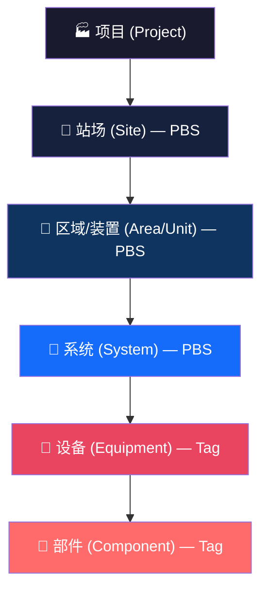

# PBS 与 Tag 的边界定义：设备和部件到底归谁？

## 核心问题

> 在电力、石化等行业中，KKS 编码从机组→系统→设备→部件层层展开。那么在我们系统里，**设备**和**部件**是 PBS 节点还是 Tag？

---

## 1. 行业标准怎么说

### KKS（电力行业）

KKS 编码体系分 4 个层级：

| 层级 | 含义 | 举例 |
|:---:|:---|:---|
| Level 0 | 全厂 (Total Plant) | `1` = 1号机组 |
| Level 1 | 系统 (System) | `1LBA` = 1号机凝结水系统 |
| Level 2 | **设备** (Equipment Unit) | `1LBA01` = 凝结水泵A |
| Level 3 | **部件** (Component) | `1LBA01AA001` = 泵体密封 |

### ISO 14224（石化行业）

ISO 14224 同样分为 9 个层级，但本质可归纳为：

| 范畴 | 层级 | 角色 |
|:---:|:---|:---|
| **位置/功能上下文** | Level 1–5: 行业→厂站→装置→系统 | 组织容器 |
| **资产/技术实体** | Level 6–9: 设备类型→设备→子单元→可维护件→零件 | 实际对象 |

### SAP PM（EAM 业界标杆）

SAP 的核心区分是：

| 概念 | 类比 | 本质 |
|:---|:---|:---|
| **Functional Location (功能位置)** | "停车位" | 不动的逻辑位置，即使换了泵，位置号不变 |
| **Equipment (设备主数据)** | "车" | 可拆卸移动的物理实体，有序列号、制造商 |

> [!IMPORTANT]  
> **关键洞察**：在所有主流系统中，"设备"和更上面的层级在概念上属于两个不同的世界——
> - 上面的层级是 **"在哪里"（Where）**，是组织结构
> - 设备及以下是 **"是什么"（What）**，是实际资产

---

## 2. 映射到我们的系统

基于以上行业共识，推荐的映射如下：

```
我们的 PBS 节点 ←→ "在哪里" (Functional Location)
我们的 Tag      ←→ "是什么" (Asset / Equipment)
```

### 具体分界线



| 层级 | KKS 等价 | 归属 | 理由 |
|:---|:---|:---:|:---|
| 项目 | 全厂 | — | 根容器 |
| 站场 / 厂区 | — | **PBS** | 物理位置 |
| 区域 / 装置 | — | **PBS** | 功能分区 |
| 系统 | System Code | **PBS** | 工艺系统，组织容器 |
| **设备** | Equipment Unit | **Tag** ✅ | 有独立属性（型号、参数）、可更换 |
| **部件** | Component | **Tag** ✅ | 设备下的可维护件 |

---

## 3. 为什么设备和部件都是 Tag？

### 3.1 设备是 Tag

- **有独立的工程属性**：功率、扬程、流量、制造商、型号……这些就是我们标准库里 Class 定义的属性
- **可替换性**：一台泵坏了换一台新泵，PBS 位置不变，但 Tag 数据变了
- **有独立生命周期**：采购、安装、检修、报废

### 3.2 部件也是 Tag

- **部件也有属性**：轴承有型号规格、密封有材质参数
- **部件也有 Class**：标准库里可以定义 Bearing、Seal 等 Class
- **设备-部件关系**：部件 Tag 通过 `parent_tag_id` 关联到设备 Tag

> [!NOTE]
> 这里有一个微妙之处：**部件的层级关系不在 PBS 里表达，而是在 Tag 之间表达**。
> 即设备 Tag 是部件 Tag 的 "父级"，这种父子关系独立于 PBS 树。

### 3.3 系统不是 Tag

- 系统**没有独立的工程属性**（你不会给 "凝结水系统" 填写功率、型号）
- 系统是**组织容器**，用于归类和定位
- 系统不可替换、不可采购

---

## 4. 对当前数据模型的影响

### 当前模型

```
PBS Node (pbs_node) — 纯层级组织
Tag (tag) — 通过 pbs_node_id 挂到 PBS 树上
```

### 需要增加的能力

Tag 之间需要支持 **父子级联** 来表达 设备→部件 的关系：

```sql
-- tag 表新增字段
ALTER TABLE tag ADD COLUMN parent_tag_id uuid REFERENCES tag(id) ON DELETE CASCADE;
```

这样一条设备 Tag 下面可以挂多条部件 Tag：

```
PBS: 1号凝结水系统
  └── Tag: P-1001 凝结水泵A (class=PUMP, pbs_node_id=xxx)
        ├── Tag: P-1001-BRG01 驱动端轴承 (class=BEARING, parent_tag_id=P-1001)
        ├── Tag: P-1001-SEAL01 机械密封 (class=SEAL, parent_tag_id=P-1001)
        └── Tag: P-1001-MTR01 驱动电机 (class=MOTOR, parent_tag_id=P-1001)
```

### 最终完整画面

```
项目 (project)
├── PBS: 厂区 A (site)
│   ├── PBS: 供水系统 (system)
│   │   ├── Tag: P-1001 进水泵 (PUMP) → 有 5 个属性
│   │   │   ├── Tag: P-1001-M01 电机 (MOTOR) → 有 3 个属性
│   │   │   └── Tag: P-1001-S01 密封 (SEAL) → 有 2 个属性
│   │   └── Tag: V-1002 进水阀 (VALVE) → 有 4 个属性
│   └── PBS: 电气系统 (system)
│       └── Tag: SW-2001 配电柜 (SWITCHGEAR)
└── PBS: 厂区 B (site)
    └── ...
```

> [!TIP]
> **两棵树，各司其职**：
> - **PBS 树**：回答 "这个东西在哪里"
> - **Tag 层级**（设备→部件）：回答 "这个东西由什么组成"

---

## 5. 结论

| 问题 | 答案 |
|:---|:---|
| 设备是 PBS 还是 Tag？ | **Tag** — 它有独立的工程属性和生命周期 |
| 部件是 PBS 还是 Tag？ | **Tag** — 它也是可描述、可维护的工程资产 |
| 设备和部件的层级关系？ | **Tag 之间的 parent_tag_id** — 不在 PBS 树内 |
| PBS 的最底层是什么？ | **系统 (System)** — 最后一个"容器级"概念 |
| 需要改什么？ | Tag 表加 `parent_tag_id` 字段支持设备→部件 |
